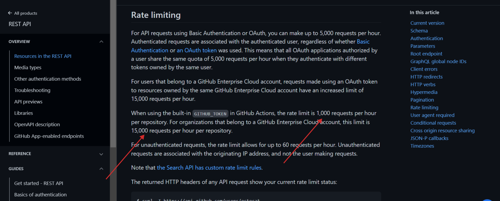
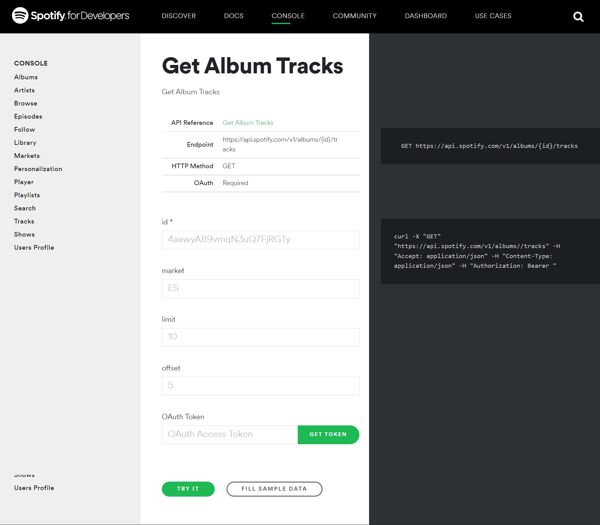

Building, designing, and consuming APIs are some of the most important aspects of every developer's career. An API should reflect the needs of users and, in this case, developers like you. As an app developer, you'll need to do one of two things:

● communicate with external sources (i.e., third-party APIs) that provide the information you need

● build an internal API for your company app or personal project

However, it's important to make your API easily accessible and flexible. So, how do you create an API that follows consistent API design, guidelines, and architecture?

In this post, I'll share the best ways to design a good API architecture regardless of the API type or protocol used by your business or application. But before we do that, let's recap the concept of an API.

### **What Is an API?**

API is an acronym for application programming interface. APIs are request types or methods that allow applications or programs to access back-end data and functionalities that enable developers to integrate and build complex applications.
A good example of this is [Facebook's Graph API](https://developers.facebook.com/docs/graph-api/). Developers use this API regularly to get data into and out of the Facebook platform. This includes uploading photos, adding Facebook comments to websites, and so on.
Another example is an operating system's API like the Windows API, popularly known as [Win32](https://docs.microsoft.com/en-us/windows/win32/). The Windows API gives programs access to resources available to a Windows system like the file systems, the user registry, buttons, scrollbar, and so on. This makes it easier for developers to implement necessary features without having to write programs from scratch every time.
Now that you've had a refresher on what an API is, let's talk about how they're designed.

### **Approaches to API Architecture Design**

There are different approaches to designing an API architecture. REST, SOAP, and RPC are a few of the popular types.

#### **SOAP**

SOAP (simple object access protocol) is a messaging protocol for exchanging information between applications. It's XML-based and can either exchange a document or call a remote procedure. In SOAP, we define a remote procedure in the sense of the client calling a specific method or procedure whenever a call is being made to the server.

#### **REST**

REST (representational state transfer) is a set of architectural styles that are used to design applications over HTTP. The idea behind REST is to use various URLs as access points to get resources from the server whenever developers need them. A RESTful API must adhere to the architecture created by Roy Fielding, whose REST guidelines include caching, client-server architecture, uniform interface, and so on.

#### **RPC**

In RPC (remote procedural call), the client makes a remote procedural call by sending an HTTP request to the server and getting a response in return.

### **How Do You Design a Good API?**

When designing your API, you must follow some important patterns and best practices. These best practices will ensure that your API is user-friendly and functional, regardless of which design architecture you choose.

#### \**Security*8

One of the most important factors to consider when designing your API is security. This is because building APIs that expose your data and application to the public also requires you to protect your system against attacks. And you don't just have to protect your own system, but also that of your partners, customers, and employees.

The more exposed an API is to the public, the more vulnerable it becomes to attacks. These attacks can include cross-site scripting, access control flaws, injections, credentials stuffing, and so on. From here, attackers can gain access to your network. This could lead to a data breach that can cause a company to lose its reputation, customers, and revenue. So, how do you secure your API?

● Employ a reliable API security service: Make use of services that help detect attacks and prevent them. For example, Traceable, an end-to-end security service for APIs and cloud-native applications, helps to automatically measure risks, discover and prevent attacks, defend your app, and analyze your data against threats.

● Follow best practices for API security: Ensure your API enforces a strong authentication and authorization solution such as Oauth2.0. It's also important to limit the number of requests that your users can return in your application by implementing pagination. And lastly, remove sensitive information like access keys and passwords before you share your API with the public.

#### **Versioning**

When designing your API, assume that you'll always need to update or modify your API over time. You need to keep the developers that'll use your API in mind when modifying your API. Developers need to know whenever you make a major update in your API to avoid their own app breaking. Including versioning in your app can be done in two ways:

● by including the API version in the header

● by including the API version in the URL

#### **How to Include the API Version in the Header**

This approach involves requesting a specific API version using the Accept header, by providing more detail (such as the API version) about a given resource.

```bash
GET  /data/5 HTTP/1
Accept: application/vnd.mydata.v1+json
```

The Accept header here is used to provide the server with information about the type of response the client can accept. Here, the API URL doesn't change across versions, but each version has a complex header attached to it. This method follows the HTTP standards, so it’s mostly recommended.

#### **How to Include the API Version in the URL**

Including the API version in the URL gives users a quick understanding of the API version they are currently using. It also helps them avoid breaking their app by only calling the endpoint with the appropriate version. Here, anyone looking to call the endpoint can easily see in the URL that the API is in its fifth version:

```bash
http://www.companyname.com/api/data/v5
```

The downside to this is that with the release of so many versions, it becomes quite tasking for companies to keep providing support for these different versions, which might impact users. In my opinion, the best way companies can manage this situation is by;

● maintaining the older versions only for a certain number of years,

● providing a release note or documents that explain the above decision to the users, and

● maintaining only the last two or three versions with the current version.

Although this method doesn't adhere to the REST API principles, it's the most common and easiest to manage.

#### **Performance**

Another requirement I consider one of the most critical when designing an API is performance. A slow API can be disastrous to the growth of a company. There are a few best practices you can keep in mind while designing your API to ensure that your API is fast and doesn’t break before or after production.

● **Caching:** Caching is used to store data that is accessed frequently by the server. Instead of making a request to the server or database every time, one can use a cached version of this request, which helps to improve performance and increase load time.

● **Define rate limits in your documentation:** Defining a rate limit helps to limit the number of requests a specific client can make in a particular period. This helps to reduce the heavy load on the app and also improve performance. Here’s an example of what a rate limit looks like from GitHub documentation.


[GitHub documentation](https://docs.github.com/en) on rate limits

### **Good Documentation**

Speaking of documentation, no matter how good an API is, it’s going to be hard to use without proper documentation. A well-documented API doesn't just attract more developers and decision-makers such as CTOs and product managers. It also makes it easier for them to test, use, or implement your API.

In order to write good documentation, you must ensure that it includes a section that provides a general overview of your API. With this, people can thoroughly understand everything your API does and how it can benefit them. From here, you can then provide a page for them to get started with the API.

You should also provide examples or a test environment where developers can test your API and make real calls. For example, take a look at this Spotify API documentation.


[Spotify Web API documentation](https://developer.spotify.com/documentation/web-api/quick-start/)

Spotify provides example code for developers. And it also makes a console available to enable developers to explore different endpoints. With this, developers can get familiar with the API endpoints. They can make requests, get responses, and learn the requirements needed to implement them.

Additionally, your API documentation must contain sections and features developers consider very important and expect to be present in every documentation. These include sections that walk developers through your authentication and authorization process, status codes and error messages, parameters, and so on.
Last, make sure your API is readable. Avoid using technical jargon. Instead, write in a plain language that's easy for anybody reading your documentation to understand.

### **A Well-Designed API Stands Out From the Crowd**

Regardless of which architecture you choose, you need to create a well-designed API because developers are your customers. So, irrespective of whether your API is paid or free, providing them with excellent service is important. Excellent service includes making sure your API is easy to use, understand, and consistent. You also want to stay ahead of the competition, and a well-designed API gives you an edge.
Consuming an API should be fun. But, unfortunately, tons of them are frustrating and difficult to use because of poor design. The key takeaway to designing a good API architecture is by adhering to the design principles mentioned above. These include good documentation, performance, security, and consistency.

Read the original post on [traceable](https://www.traceable.ai/blog-post/delightful-api-architectures/)
