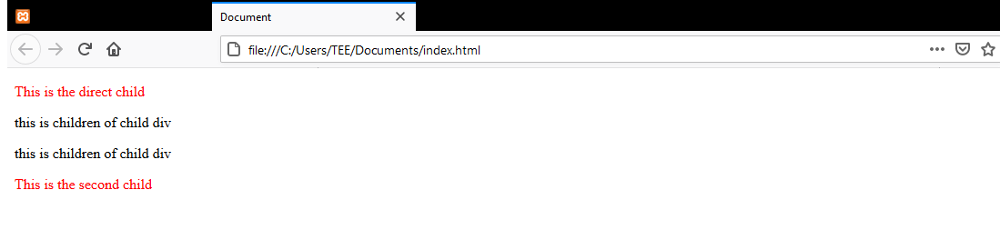
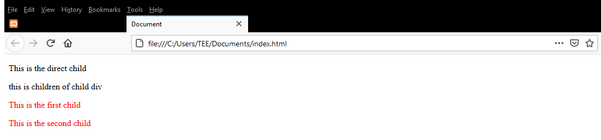
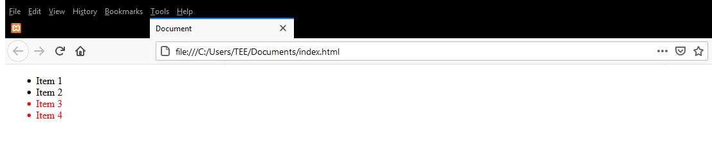
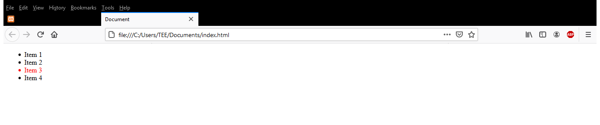
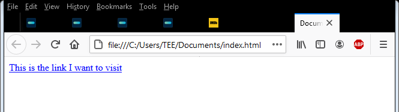
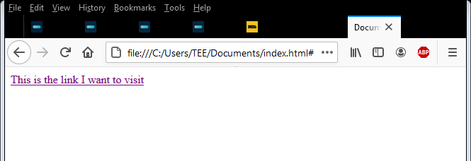
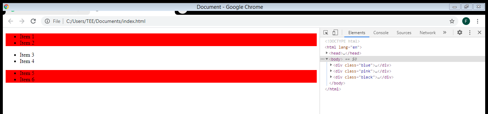

## **Introduction**

When I started writing CSS, I only learned how to use class, Id, types and space selectors and I thought that was all to it. With time, I learnt more about new selectors and I’ll be sharing some of them with you in this article.
CSS selectors are used to target or select HTML elements that you want to style. There are wide variety of CSS selectors available, but for the purpose of this article, I’ll be discussing just 5 of these selectors;

1. Direct Child Selector (> sign).
2. General Sibling Selector (~ sign).
3. Adjacent Sibling Selector (+ sign)
4. Link Pseudo-classes
5. Negation Pseudo-class (:not( y ) )

### **Direct Child Selector (> sign)**

This selector target elements that are direct children of the container div only. It’s better used when only the direct children of the parent element need to be selected. For example;

```html
<div class="box">
  <p>This is the direct child</p>
  <div>
    <p>this is children of child div</p>
    <p>this is children of child div</p>
  </div>
  <p>This is the second direct child</p>
</div>
```

```css
.box > p {
  color: red;
}
```



.box > p here identifies only the P tags that falls directly under the .box container div.
The children of the child div doesn’t carry the red colour because they aren’t the direct elements of the container div.

### **General Sibling Selector (~ sign)**

The ~ sign is a sibling combinator that targets all elements after the selected elements, it could be a div, type or just a class. Looking at the previous example; If you want to select all P tags after the box-child div, we can do this;

```html
<div class="box">
  <p>This is the direct child</p>
  <div class="box-child">
    <p>this is children of child div</p>
  </div>
  <p>This is the first child</p>
  <p>This is the second child</p>
</div>
```

```css
.box-child ~ p {
  color: red;
}
```

And then, we get this result;



Another example we can also look at is this;
If you have a list of items and you want to select some items on the list without affecting the others, we can also use this ~ selector.

```html
<div class="box">
  <ul>
    <li>Item 1</li>
    <li class="list1">Item 2</li>
    <li>Item 3</li>
    <li>Item 4</li>
  </ul>
</div>
```

```css
li.list1 ~ li {
  color: red;
}
```

So, here, you’re saying I want all Li’s after the Li with the class of .list1 to have a red colour. The third and fourth item here changes to a red colour without including the first and second item.



### **Adjacent Sibling Selector (+ sign)**

This is also a sibling combinator that combines elements that have the same parent div. It selects only the element directly after the former selector.
Looking at the list item example we had earlier; To select **only** the list item directly after the Li with the list1 class, you can use the +(plus) symbol.

```html
<div class="box">
  <ul>
    <li>Item 1</li>
    <li class="list1">Item 2</li>
    <li>Item 3</li>
    <li>Item 4</li>
  </ul>
</div>
```

```css
li.list1 + li {
  color: red;
}
```

And you should get this as a result;



### **Link Pseudo-classes**

Using link pseudo-classes gives you the ability to style various states of your HTML link. The two link pseudo classes are :link and :visited pseudo classes.
• :link pseudo class is used to target links that haven’t been clicked or visited by that same browser, while;
• :visited pseudo class is used to target links that has already been visited by that current browser.
Here is an example;

```html
<div class="html-links">
  <a href="#">This is the link I want to visit</a>
</div>
```

```css
<style>
 a:link{
     color:blue;
 }
 a:visited{
     color: purple;
 }
    </style>
```

You have this when the link hasn’t been clicked;



And this, when the link has been clicked.



### **Negation Pseudo-class (:not( y ) )**

This selector I’ll say is the most powerful of all the selectors I’ve mentioned so far. It’s a negation pseudo class that accepts a single selector as an argument and also prevents items that do not belong to that class from being selected, hence, the name negation – pseudo class, for example;
If you have a small div with a background image and a text overlay and you want to select the text displayed on this image and also style the div itself; Instead of using two different selectors to get this done(i.e one to style the div and another one to negate it), you can use the :not( ) selector, which will in this context select every element except those that do not match the argument passed. Just like the one below;

```css
.div:not(img) {
  background-color: Red;
}
```

This example here is saying “I want to select every element in this div that’s not an image”, the only element that’s not an image here is the text-overlay right? Which adds a background colour of red to the text overlay.

Another example we can look at is the one below;

```html
<div class="blue">
  <ul>
    <li>Item 1</li>
    <li>Item 2</li>
  </ul>
</div>
<div class="pink">
  <ul>
    <li>Item 3</li>
    <li>Item 4</li>
  </ul>
</div>
<div class="black">
  <ul>
    <li>Item 5</li>
    <li>Item 6</li>
  </ul>
</div>
```

```css
 <style>
 div:not(.pink){
    background-color: red;
}
 </style>
```

Here we have two different divs with different classes and this code is saying, “hey, I want to select all divs without the class of pink and I want them to all have a background of red. Which should give you this result;



Kindly share if found useful and feel free to reach out to me on [twitter](https://twitter.com/racheltomidev);

Thanks for reading.
