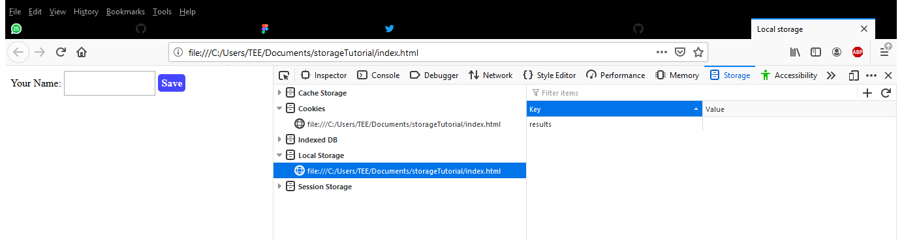
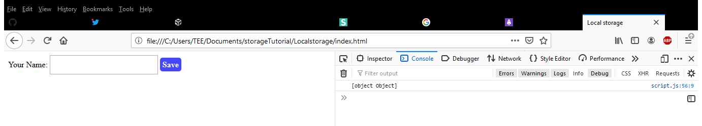
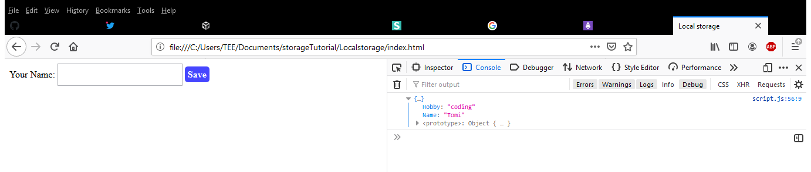
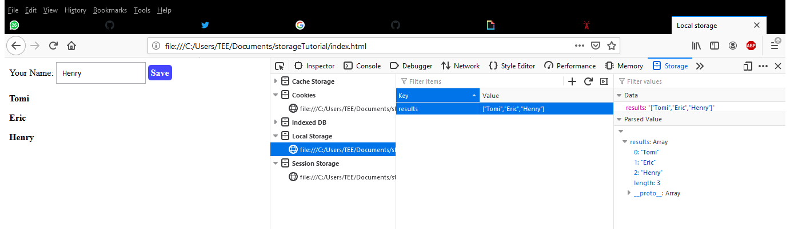

I will say I’ve never heard about local storage since I started to learn JavaScript, not until I had to build a simple project for personal development and I needed to store my data somewhere. The best option available was local storage and yeah, that was my first time hearing the word “local storage”.

I made a documentation of what I learnt and I’ve decided to share them with you in this article.
There are several standards available for storing data in a user web browser; Some of them are;

1. **Cookies:** Using Cookies was pretty much the only way data are stored in the browser until recently. It provides a maximum of 4kb of data storage, which means larger data can’t be stored all at once. Cookies are sent to the server for every request you make, and can be read on both client and server side, but will be in-accessible to the client-side scripts if the cookie is marked as Http only.

2. **Web SQL:** Web SQL is similar to using relational databases and SQL, it involves storing data in a database and retrieving it using SQL. It has the capacity to store larger amount of data unlike cookies.

3. **Session Storage and Local Storage:** These are both ways of storing data in JavaScript, the only major difference is that, data stored in session storage gets cleared when the page is refreshed or when the browser is closed, but data stored in local storage persists. It doesn’t get cleared even after the page has been refreshed.

For the purpose of this article, I’ll be focusing more on “local storage”.

### **Local Storage?**

Local storage is basically a way of storing information locally in the browser. It has the capacity to store up to 5mb of user data and also accessible from any browser or window. Another thing to note is, local storage is domain specific,

i.e. you only have access to an information you’ve saved when you are working with the domain that holds that data.

For example; if my website is mytodos.com, and I have stored todos like “read my book”, “do my assignment”, “go to the market” in that domain, I can only have access to these todos (data) when I visit mytodos.com.

### **How Do I Access My Local Storage?**

Local storage can be accessed right from your web browser since all stored data are saved across browsers in JavaScript. First, you need to go to your developer tools by pressing F12, then go to the application tab, right there, you will find your local storage (F12 – application - storage – local storage – YourprojectPath ).

;

Data can be stored based on named key/value pairs, you store your data with a key and retrieve your data with that same key.
To use local storage in Js, there are methods you need to get familiar with;

1. setItem()
2. getItem( )
3. remove( )
4. clear( )

**setItem( ):** This method is use to store key/value pairs to the local storage. The setItem method looks like the one we have below.

```js
localStorage.setItem("name", "Tomi");
```

‘name’ here is the key while ‘Tomi’ is the value. The main function of this ‘key’(‘name’) is to be able to fetch the value (‘Tomi’) attached to it later when we need it. To get back this value we have stored, we need to make use of the getItem( ) method.

**getItem( )**

```js
const user = localStorage.getItem("name");

//Tomi
```

As we can already see, getItem( ) can be used to get values already stored in the local storage by calling the key (‘name’) the value is attached to. Another point to note is that local storage has the ability to store only strings, this is because when objects or arrays are stored without been converted to strings, and the values are checked in the console, it appears that these values are only stored as objects without displaying the real object information. Okay, that might be a bit confusing, let’s take a look at this;

```js
const user = {
  Name: "Tomi",
  Hobby: "coding",
};
localStorage.setItem("users", user);
console.log(localStorage.getItem("users", user));
```

Now, when we check this in our console, we get something like this [object object]

;

This isn’t so useful because the real object information we need is not included. To fix this, this object has to be converted first to a string using the JSON.stringify( ) method and converted back to an object using the JSON.parse( ) method.
Let’s take a look at this example;

```js
const user = {
  Name: "Tomi",
  Hobby: "coding",
};
localStorage.setItem("users", JSON.stringify(user));
console.log(JSON.parse(localStorage.getItem("users", user)));
```

Running this code, we get this in our console;

;

JSON.stringify( ) here has successfully converted these objects into string and we’re able to parse it back into the local storage using JSON.parse( ).
**removeItem( ):** Calling the removeItem( ) method removes the value of a given named key. Now, let’s try to remove the value we got earlier,

```js
localStorage.removeItem("users");
```

If we try to get this value back using getItem(), we get //Null as the result.

```js
const user = localStorage.getItem("users");

//Null
```

**Clear( ):** This method is used to clear or delete all the data already stored in local storage using localstorage.clear( ) method. This can be a little tricky, for me, what I do is go to my editor, copy all my codes and keep them somewhere or better still, comment them out. I make sure everything is cleared, then I write \*\*localstorage.clear( ), save and reload the browser… and everything gets cleared. Now, you can go back to your editor and paste or comment out your code, save and refresh your browser and you’re good to go.
To make us understand these methods better, we are going to build a simple input page that save users name in the local storage even after the browser has been refreshed.
Let’s start with the HTML and CSS to speed things up;

```html
<!DOCTYPE html>
<html lang="en">
  <head>
    <meta charset="UTF-8" />
    <meta name="viewport" content="width=device-width, initial-scale=1.0" />
    <title>Local storage</title>
  </head>
  <body>
    <label for="name">Your Name:</label>
    <input id="nameTag" type="text" />
    <a href="#" class="save-btn">Save</a>

    <div class="display">
      <p></p>
    </div>

    <script src="./script.js"></script>
  </body>
</html>
```

And our index.css looks like this, nothing serious, just some paddings and colours.

```css
body {
  display: flex;
  align-items: center;
  justify-content: center;
  margin: 200px;
}
.save-btn,
.click-btn {
  color: white;
  background-color: rgba(0, 0, 255, 0.726);
  font-weight: bold;
  padding: 10px 10px;
  text-decoration: none;
  border-radius: 5px;
  margin: 0 5px;
}
input[type="text"] {
  padding: 10px 10px;
  width: 30%;
}
.display {
  font-weight: bold;
  background-color: pink;
}
```

Moving to the JavaScript, first let’s define our variables.

```js
const inputTag = document.getElementById("nameTag");
const saveButton = document.querySelector(".save-btn");
const Display = document.querySelector(".display");
```

Now that our variables have been defined, we can then make our button clickable by adding EventListeners.

```js
saveButton.addEventListener("click", saveBtn);
```

Since our saveBtn haven’t been defined, we have to use this function to execute our plan to make our button clickable and our input value visible on our browser.

```js
function saveBtn(event) {
  event.preventDefault();
  const displayName = document.createElement("p");
  displayName.classList.add("showName");
  displayName.innerText = inputTag.value;
  Display.appendChild(displayName);
}
saveBtn();
```

What we’ve successfully done here is that we created another element within our html using createElement(which is our <p> tag), we added a new class and then called our html input value using inputTag.value and finally appended this value to the display div.
Now that we are able to display our input value, the next step is to save this input value in our browser local storage. To achieve this, the first thing to do is call the DOMContentLoaded event.

```js
document.addEventListener("DOMContentLoaded", showSavedResult);
```

This event runs when all the page’s DOM content has been loaded and parsed. Its target doesn’t include external resources like styles, images and so on, it sees the styles and images but doesn’t wait for them to completely load. So, this is the exact event that holds our local storage function, so it doesn’t get cleared even after the browser has been reloaded.
Let’s move on to define our ‘showSavedResult’ function;

```js
function saveName() {
  let results;
  if (localStorage.getItem("results") === null) {
    results = [];
  } else {
    results = JSON.parse(localStorage.getItem("results"));
  }
  results.push(inputTag.value);
  localStorage.setItem("results", JSON.stringify(results));
}
```

Basically, what this code does is, it checks first if we already have an array stored in the local storage, if we don’t, it creates an empty array ( results = [ ]; ) and if we already have an array, we parse back our array and push our values into this empty array. We then set it back to a string using the setItem( ) and JSON.stringify( ) method. For this code to run successfully, we have to call our saveName function inside the main function,

```js
function saveBtn(event){
    event.preventDefault();
   …
 saveName();
}

```

By now, we should be seeing our arrays in the local storage, and we’ll also notice that our small data doesn’t get cleared in the local storage if we try to refresh our browser.

;

Yes, we have successfully stored our small data in our local storage.

## **Conclusion**

Local storage is not limited to what I’ve written above, but I hope it’s able to give you the basic understanding you need to make use of your local storage. With the lesson, we should be able to set an item to the local storage, get back our item, remove our item and also get to clear all data present in the local storage.
Feel free to leave a comment or share if this post was helpful to you.
