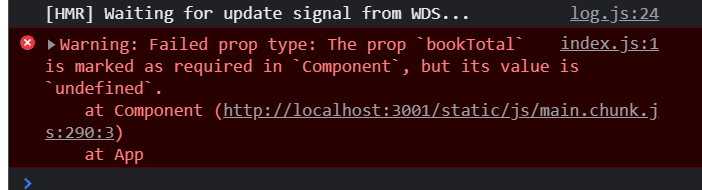
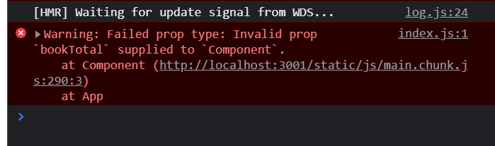
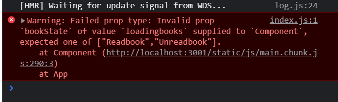

Proptypes is a package that is used to check how data types flows between react components. It’s a runtime type checking that helps to validate props passed between react components.

### **Why do we Need PropTypes?**

When writing react, it is easy to mistakenly pass the wrong props to a component, which causes a bug that can be difficult to track down especially when building big projects with lots of components.
JavaScript functions accept data of different types without throwing an error even if it’s not what’s expected. For example;
The Component.js file below has two props called **_name_** and **_bookTotal_** with data types of strings and number respectively.

```js
import React from "react";

const Component = ({ name, bookTotal }) => {
  return (
    <div>
      <p>
        my name is {name} and I have {10 + bookTotal} books
      </p>
    </div>
  );
};

export default Component;
```

Moving forward, we will need to pass our Component into our **_App.js_** file in other for us to be able to pass in our props into the component and also see what our app looks like.

Now if we mistakenly pass the prop named **_bookTotal_** as a string instead of a number (just like we have in the code below), our app will behave unexpectedly, but there won't be an error in the console.

```js
import "./App.css";
import Component from "./Component";

function App() {
  return (
    <div className="App">
      <Component name="Tomisin" booksTotal="20" />
    </div>
  );
}

export default App;
```

Below is what the result looks like;


In our **_Component.js_** file, we were trying to perform basic JavaScript addition by adding 10 and **_bookTotal_** prop together, which is meant to give us a total of 30 books, but now our result shows 1020 books, which is wrong.

What JavaScript did was converted the number (10) to a string and moved on to the next operation of merging both strings together without giving an actual error that “a number is expected instead of a string”.

A good way to help JavaScript detect mistakes like this is by using **_PropTypes_** or Typescript. Both methods are good, but in my opinion, your choice depends on how large your app is going to be or how you intend to use it. If you’re building a smaller app or a tool/library that will be used by others, using PropTypes might be the best option. And I’ll be talking more about PropTypes for the purpose of this article.

#### **Getting Started**

To use PropTypes in react we need to install the dependency with the command below;

```bash
npm install prop-types –save
```

Then you import it into your project files like this;

```js
import PropTypes from "prop-types";
```

### **Using PropTypes in React**

There are different validators in PropTypes that can be used to check whether the data one received is valid.
Basic data types.
This is the most basic way one can check if a prop is valid in react components. And this is done by checking if the prop is one of the primitive data types in Javascript such boolean, strings, numbers etc.

Below is a list of all the basic PropTypes for checking data type in JavaScript;

```js
PropTypes.bool; //must be a Boolean
PropTypes.object; //must be an object
PropTypes.number; //must be a number
PropTypes.string; //must be a string
PropTypes.func; //must be a function
PropTypes.array; //must be an array
PropTypes.symbol; //must be a symbol
PropTypes.any; //For any property
```

From the first example above, we can avoid the mistake of passing a string instead of number by enforcing the PropTypes property on our component like this;

```js
import './App.css';
import Component from './Component';
import PropTypes from 'prop-types';

function App() {
…

Component.propTypes = {
  name: PropTypes.string,
  bookTotal: PropTypes.number
}

export default App;
```

Using this PropType, we can make sure that “name” is always a string and “bookTotal” is always a number, and when we do otherwise just like we did earlier we will have the warning below in our console;


#### **Required types**

To ensure that a particular prop is mandatory or required for a particular component, we can specify the isRequired property;

```js
…
function App() {
…

Component.propTypes = {
  name: PropTypes.string.isRequired,
  bookTotal: PropTypes.number.isRequired
}

export default App;
```

Since we have specified that the two props are required, it is important that to pass a value to both components. If we do not pass a value to **_bookTotal_** for example, we will receive the warning below in the console.



#### **Multiple Types**

There are also PropTypes that only allow limited data types for a prop. They are;

• PropTypes.OneOfType,

• PropTypes.OneOf

**PropTypes.OneOfType:** This method can be used to specify the exact data type that a prop can be and only takes an array of the PropTypes that are valid. Consider the example below;

```js
function App() {
  return (
    <div className="App">
      <Component name="Tomisin" bookTotal={4} />
    </div>
  );
}

Component.propTypes = {
  bookTotal: PropTypes.oneOfType([PropTypes.array, PropTypes.number]),
};

export default App;
```

Here we are saying the bookTotal prop can either take in a number or an array. For example If pass a string instead of a number or an array, then we have the below warning;



**PropTypes.OneOf:** This is another method that is similar to the oneOfType method but the oneOf method takes in an array of value instead of an array of props. This is mostly useful if you have a set of named constant for different states. For example, you can set two constant states to the bookState prop, this means the said prop can only be valid when you have only the two states in the example below.

```js
function App() {
  return (
    <div className="App">
      <Component name="Tomisin" bookState="loadingbooks" />
    </div>
  );
}

Component.propTypes = {
  bookState: PropTypes.oneOf(["Readbook", "Unreadbook"]),
};

export default App;
```

Because “loadingbooks” is not among the array passed to the Props, we have the error below;



### \**Conclusion*8

We have seen how PropTypes can be very useful in validating data types in react, which can be a good way to catch errors and also flag props as important when building our applications in other also make sure they work as expected.
Thanks for reading…
